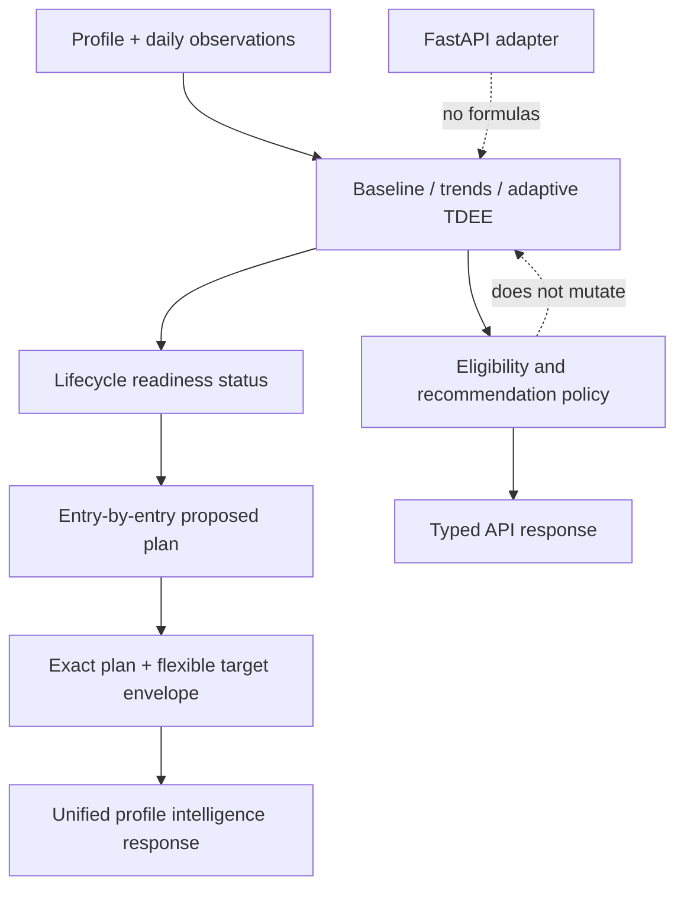
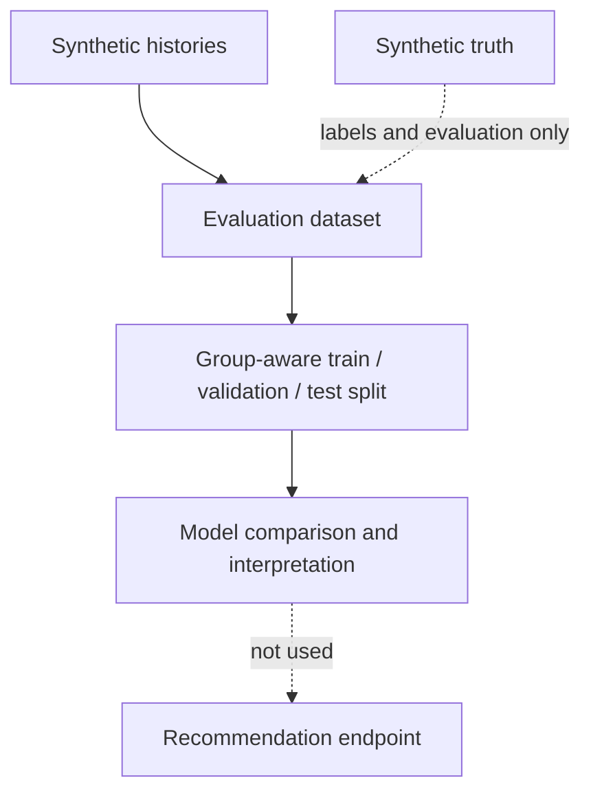

# FitAdapt

[](https://github.com/aristostheo/fitadapt/actions/workflows/ci.yml)

FitAdapt is a transparent fitness-intelligence engine that combines deterministic baseline calculations, longitudinal trend analysis, adaptive energy-expenditure estimation, synthetic evaluation, leakage-safe ML experimentation, conservative recommendations, and a stateless FastAPI interface.

## What It Does

FitAdapt keeps explainable decision support separate from research: versioned REE/TDEE, calorie and macro targets, explicit preference-driven macro plans with flexible target envelopes, calendar-aware trends, adaptive observed-data TDEE, lifecycle readiness, entry-by-entry proposed planning, and a conservative eligibility-gated recommendation policy. `POST /v1/profile-intelligence` composes those existing outputs into one stateless client response. Synthetic histories support evaluation and ML experiments only; FastAPI has no formulas or persistence.

| Layer           | Role                                                                                                                                                                        |
| --------------- | --------------------------------------------------------------------------------------------------------------------------------------------------------------------------- |
| Baseline        | Deterministic REE, activity-adjusted TDEE, calorie and macro targets.                                                                                                       |
| Adaptive        | Intake and weight-trend observed-data approximation.                                                                                                                        |
| Research        | Fixed-seed synthetic evaluation and leakage-safe ML benchmark.                                                                                                              |
| Recommendations | Conservative decision support; never automatically applied.                                                                                                                 |
| Personalization | Lifecycle readiness, proposed per-entry plans, explicit V1 macro strategies, policy-based target ranges, dietary flexibility, and informational training-demand assessment. |
| API             | Stateless typed adapter, including unified profile intelligence; no stored user data.                                                                                       |
| Web client      | Session-only five-stage guided experience with dietary onboarding, historical import, flexible Plan targets, and Progress charts.                                           |

## Fixed-Seed Synthetic Results

Adaptive TDEE paired MAE results (`kcal/day`):

| Scenario                   | Eligible dates | Adaptive MAE | Paired MAE change |
| -------------------------- | -------------: | -----------: | ----------------: |
| Clean constant expenditure |             47 |        0.000 |          100.000% |
| Noisy observations         |             47 |      249.005 |           39.191% |
| Missing data               |             34 |      241.287 |           41.493% |
| Calorie underreporting     |             47 |      250.000 |           63.181% |
| Calorie overreporting      |             47 |      250.000 |         -400.000% |
| Baseline mismatch          |             47 |        0.000 |          100.000% |

The complete-history ML split is `18 / 6 / 6`. Selected `linear` validation MAE is `0.175475` kg, versus dummy `0.405652`, Ridge `0.175525`, and random forest `0.310848`; held-out MAE/RMSE/R² are `0.159362 / 0.200325 / 0.716630` (dummy MAE `0.369595`). These are synthetic-only results, not claims about real people. Leading permutation diagnostics are window weight change (`0.11913`) and trailing intake (`0.09338`); correlated features make these non-causal.

## Architecture





## Quick Start

Python 3.12 and [uv](https://docs.astral.sh/uv/) are required.

```bash
uv sync
uv run python examples/demo.py
uv run pytest
```

Technology: Python 3.12, NumPy, pandas, scikit-learn, FastAPI, Pydantic, pytest, Ruff, and uv.

## API

## Standalone Web App

Run the FastAPI service, then start the React/Vite client from [`web/`](web/README.md). The client uses session-only state, fictional sample history, and the public HTTP API; it is not the future main fitness-app integration.

```bash
uv run uvicorn fitadapt.api.app:app --reload
curl http://127.0.0.1:8000/health
curl -X POST http://127.0.0.1:8000/v1/baseline -H 'content-type: application/json' --data @examples/baseline_request.json
```

Swagger is at `http://127.0.0.1:8000/docs`; see [API documentation](docs/api.md) and the [recommendation request](examples/recommendation_request.json).

## Responsible Use

FitAdapt is decision support, not medical treatment. It has no clinical validation and is sensitive to logging bias, scale noise, water/glycogen change, and the Mifflin-St Jeor sex-category limitation. Synthetic benchmarks do not establish real-world accuracy. The API stores no data; personal fitness data must not be committed. Multi-user use requires authentication and authorization, and outputs must not be automatically applied.

## Documentation

- [Architecture](docs/architecture.md), [baseline ADR](docs/decisions/0001-v0.1-baseline-policy.md)
- [Synthetic data](docs/synthetic-data.md), [trends](docs/trend-analysis.md), [adaptive TDEE](docs/adaptive-tdee.md)
- [TDEE evaluation](docs/tdee-evaluation.md), [weight-change ML](docs/weight-change-ml.md), [interpretation](docs/model-interpretation.md)
- [Calorie recommendations](docs/calorie-recommendations.md), [API](docs/api.md)
- [Personalization lifecycle](docs/personalization-lifecycle.md), [personalized planning](docs/personalized-planning.md), [personalized macro plans](docs/personalized-macros.md), [nutrition target ranges](docs/nutrition-target-ranges.md), [profile-intelligence API](docs/profile-intelligence-api.md)
- [Dietary preferences](docs/dietary-preferences.md)
- [Training demand](docs/training-demand.md)
- [Training-aware nutrition](docs/training-aware-nutrition.md)
- The web client guides users through Profile, Nutrition, History, Plan, and Progress in session-only browser state; see [web README](web/README.md).
- [Historical import](docs/historical-import.md), [standalone web client](web/README.md)

## Roadmap

Real-world evaluation, storage, authentication, client integration, and license selection remain release work. FitAdapt does not yet provide frontend dietary onboarding, individual food selection, recipes, meal generation, medical nutrition therapy, micronutrient analysis, training-day/rest-day targets, or budget/cuisine/cooking/schedule optimization.
