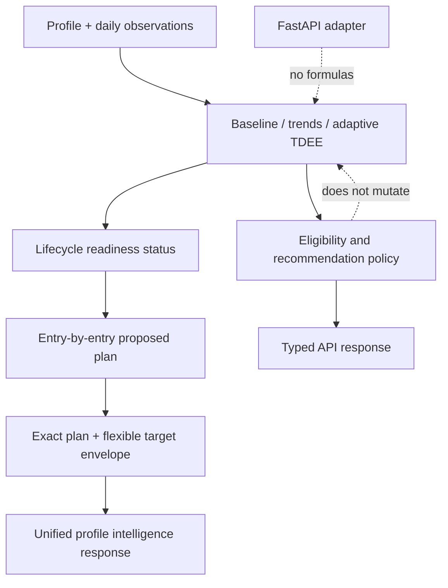
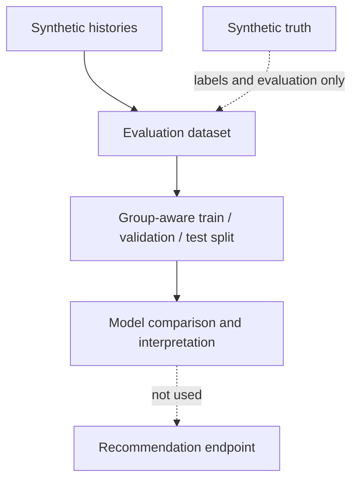

# FitAdapt

[](https://github.com/aristostheo/fitadapt/actions/workflows/ci.yml)

FitAdapt is a deterministic, explainable diet-planning and intelligence engine for a consuming fitness app. It calculates baseline energy needs, estimates adaptive TDEE from longitudinal observations, composes calorie and macro plans, assesses adherence and outcomes, and returns conservative proposals with safety and activation gates through a stateless API.

Adaptive TDEE is observational supporting evidence, not measured metabolism. Persistent non-energy
weight drift can be indistinguishable from true energy-balance change using only dates, scale weight,
and logged intake, so FitAdapt may deliberately hold or defer calorie changes. Calorie decreases use
a stricter CP29 evidence gate and remain review-required before activation; increases retain their
existing readiness policy. Opposite-direction proposals require a stateless, new-evidence confirmation
cycle. Proposals are never automatically applied. All benchmark claims are
**in-model synthetic evaluation**, not real-world or clinical validation.

## What It Does

FitAdapt can:

- Calculate profile-based REE, baseline TDEE, calorie targets, and macros.
- Estimate observational adaptive TDEE from dated weight and logged-intake histories.
- Compose macro plans from explicit preferences and training context, and assess dietary feasibility.
- Assess adherence and recent plan outcomes.
- Propose calorie changes, gate repeated adaptations conservatively, and return history/explainability.
- Expose one app-facing `current_recommendation` and structured `integration_status` through `POST /v1/profile-intelligence`.

FitAdapt returns typed decision support; the consuming app decides what to display and what accepted plan to store.

| Layer           | Role                                                                                                                                                                                                                         |
| --------------- | ---------------------------------------------------------------------------------------------------------------------------------------------------------------------------------------------------------------------------- |
| Baseline        | Deterministic REE, activity-adjusted TDEE, calorie and macro targets.                                                                                                                                                        |
| Adaptive        | Intake and weight-trend observed-data approximation.                                                                                                                                                                         |
| Research        | Fixed-seed synthetic evaluation and leakage-safe ML benchmark.                                                                                                                                                               |
| Recommendations | Conservative decision support; never automatically applied.                                                                                                                                                                  |
| Personalization | Lifecycle readiness, proposed plans, macro strategies/ranges, dietary preferences, training-aware macro composition, nutrition-feasibility guidance, outcome review, proposal decisions, and longitudinal activation gating. |
| API             | Stateless typed adapter, including unified profile intelligence; no stored user data.                                                                                                                                        |
| Web client      | Session-only five-stage guided experience with dietary onboarding, historical import, flexible Plan targets, and Progress charts.                                                                                            |

## Fixed-Seed Results

All benchmark tables below are **in-model synthetic evaluation**, not external, real-world, or clinical validation.

Adaptive TDEE paired MAE results (`kcal/day`):

| Scenario                   | Eligible dates | Adaptive MAE | Paired MAE change |
| -------------------------- | -------------: | -----------: | ----------------: |
| Clean constant expenditure |             47 |        0.000 |          100.000% |
| Noisy observations         |             47 |      249.005 |           39.191% |
| Missing data               |             34 |      241.287 |           41.493% |
| Calorie underreporting     |             47 |      250.000 |           63.181% |
| Calorie overreporting      |             47 |      250.000 |         -400.000% |
| Baseline mismatch          |             47 |        0.000 |          100.000% |

The complete-history ML split is `18 / 6 / 6`. Selected `linear` validation MAE is `0.175475` kg, versus dummy `0.405652`, Ridge `0.175525`, and random forest `0.310848`; held-out MAE/RMSE/R² are `0.159362 / 0.200325 / 0.716630` (dummy MAE `0.369595`). These are synthetic-only results, not claims about real people. Leading permutation diagnostics are window weight change (`0.11913`) and trailing intake (`0.09338`); correlated features make these non-causal.

The final CP35B confirmatory cohort passed all 17 frozen synthetic release criteria across 1,500 users. An earlier independent CP35A held-out cohort contained one genuine pre-onset false positive (seed `150011`); it was reproduced, audited for leakage, and retained in the validation record. The larger independent CP35B result is consistent with that small-sample observation; neither result was hidden or retuned. See [the complete validation record](docs/cp35-final-validation.md).

## Architecture


```mermaid
flowchart TD
    P[Profile + daily observations] --> B[Baseline / trends / adaptive TDEE]
    B --> L[Lifecycle readiness status]
    L --> Q[Entry-by-entry proposed plan]
    Q --> N[Exact plan + flexible target envelope]
    N --> U[Unified profile intelligence response]
    B --> E[Eligibility and recommendation policy]
    E --> A[Typed API response]
    F[FastAPI adapter] -. no formulas .-> B
    E -. does not mutate .-> B
```


```mermaid
flowchart TD
    S[Synthetic histories] --> D[Evaluation dataset]
    D --> G[Group-aware train / validation / test split]
    G --> M[Model comparison and interpretation]
    T[Synthetic truth] -. labels and evaluation only .-> D
    M -. not used .-> R[Recommendation endpoint]
```

## Quick Start

Python 3.12 and [uv](https://docs.astral.sh/uv/) are required.

```bash
uv sync
uv run python examples/demo.py
uv run pytest
```

Technology: Python 3.12, NumPy, pandas, scikit-learn, FastAPI, Pydantic, pytest, Ruff, and uv.

## Standalone Web App

Run the FastAPI service, then start the React/Vite client from [`web/`](web/README.md). The client uses session-only state, fictional sample history, and the public HTTP API; it is not the future main fitness-app integration.

```bash
uv run uvicorn fitadapt.api.app:app --reload
curl http://127.0.0.1:8000/health
curl -X POST http://127.0.0.1:8000/v1/baseline -H 'content-type: application/json' --data @examples/baseline_request.json
```

Swagger is at `http://127.0.0.1:8000/docs`; see [API documentation](docs/api.md) and the [recommendation request](examples/recommendation_request.json).

## What FitAdapt Is Not

FitAdapt does not provide meal generation, workout generation, medical diagnosis, clinical nutrition, measured metabolism, or guaranteed real-world weight outcomes. Meal and workout generation belong in the consuming fitness app. The engine does not provide accounts, persistence, authentication, or notification delivery.

## Known Limitations

- Adaptive TDEE is inferred from observations; it is not measured expenditure or metabolism.
- Water, glycogen, sodium, illness, and other non-energy weight changes can distort trends.
- Logging bias and hidden non-adherence can be indistinguishable from a true expenditure change when only weight, logged intake, and dates are available.
- Calorie decreases intentionally require conservative evidence and explicit review; proposals are not automatically applied.
- Real logged-data validation is limited. Synthetic benchmarks do not establish external accuracy, clinical validity, or likely weight outcomes.
- Safety decisions depend on self-reported profile data. BMI is a screening/product-policy input, not a diagnosis; a stateless API cannot prevent deliberate misreporting.
- The API stores no profile, observations, active plan, or adaptation history. The consuming app owns persistence, accounts, authentication, daily logging UI, notifications, and acceptance of active-plan changes.
- FitAdapt is decision support, not medical treatment. It does not offer individual food selection, recipes, micronutrient analysis, or medical nutrition therapy.

Do not commit personal fitness data. Multi-user deployments require app-level authorization and appropriate user safeguards.

## Documentation

- [Architecture](docs/architecture.md), [baseline ADR](docs/decisions/0001-v0.1-baseline-policy.md)
- [CP35 final hostile validation protocol and results](docs/cp35-final-validation.md)
- [Synthetic data](docs/synthetic-data.md), [trends](docs/trend-analysis.md), [adaptive TDEE](docs/adaptive-tdee.md)
- [TDEE evaluation](docs/tdee-evaluation.md), [weight-change ML](docs/weight-change-ml.md), [interpretation](docs/model-interpretation.md)
- [Calorie recommendations](docs/calorie-recommendations.md), [API](docs/api.md)
- [Personalization lifecycle](docs/personalization-lifecycle.md), [personalized planning](docs/personalized-planning.md), [personalized macro plans](docs/personalized-macros.md), [nutrition target ranges](docs/nutrition-target-ranges.md), [profile-intelligence API](docs/profile-intelligence-api.md)
- [Dietary preferences](docs/dietary-preferences.md)
- [Training demand](docs/training-demand.md)
- [Training-aware nutrition](docs/training-aware-nutrition.md)
- [Nutrition feasibility](docs/nutrition-feasibility.md)
- [Plan outcome assessment](docs/plan-outcome-assessment.md)
- [Recommendation decisions](docs/recommendation-decisions.md)
- [Plan adaptation](docs/plan-adaptation.md)
- [Recommendation history](docs/recommendation-history.md)
- [App integration](docs/app-integration.md)
- [Target safety](docs/target-safety.md)
- The web client guides users through Profile, Nutrition, History, Plan, and Progress in session-only browser state; see [web README](web/README.md).
- [Historical import](docs/historical-import.md), [standalone web client](web/README.md)

## Release Readiness

The Python package metadata is currently `0.1.0`; `1.0.0` is the recommended first stable release version. No Git tag has been created. The repository has no `LICENSE` file and no license choice has been established; license selection remains a manual legal release decision.

The standalone web build currently emits Vite's advisory for a minified JavaScript chunk above 500 kB, largely due to charting dependencies. It is non-blocking for the engine package; code splitting is deferred rather than expanding the frontend release-hardening scope.
